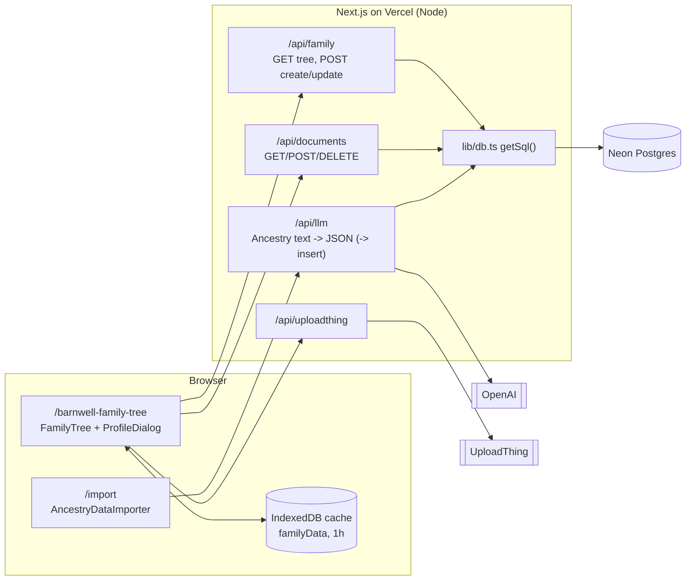

# Architecture (current state)

Owned by the **architect**. Describes what exists today; decisions that change it go in `docs/adr/`.

## Data model (`db/schema.sql`)

- `family_node`: one row per person. Parents are stored twice: as `fatherId`/`motherId` columns **and** as rows in `child`. `GET /api/family` builds `parents` from the columns and `children` from `child`, so both must be kept in sync (REVIEW_LOG #7).
- `spouse`: one row per marriage, read as two-way.
- `child`: `(parent_id, child_id)`.
- `documents`: files per person (`userId` = the person's id, not an app user).
- There is no `users` or `trees` table yet: everything is one global tree with a hard-coded root (`ROOT_NODE_ID`).

## Request flow

The tree page fetches `/api/family` once (cached in IndexedDB for an hour), `react-family-tree` lays it out, and clicking a person opens `ProfileDialog`, whose content is switched through `DialogContext` (`NODE_PROFILE`, `EDIT_NODE`, `DOCUMENT_UPLOADER`).

## Testing seams

- `getSql()` is lazy and swappable (`setSql`) -> integration tests run real SQL on PGlite.
- `DATABASE_URL=pglite://memory` -> the whole app runs on an in-memory DB seeded with `e2e/fixtures/seed.sql` (Playwright).
- OpenAI is constructed per request -> mocked with `jest.mock("openai")`.

## Known structural gaps (each has a ticket)

1. No authentication or authorization; all writes are public.
2. Single global tree; Barnwell-specific root, title, and redirect.
3. Schema exists in two places (`db/schema.sql`, `scripts/seed.js`); no migrations.
4. Parent links stored redundantly (columns + `child` table) without a transaction.
5. Client cache invalidation after writes is broken (REVIEW_LOG #6).
